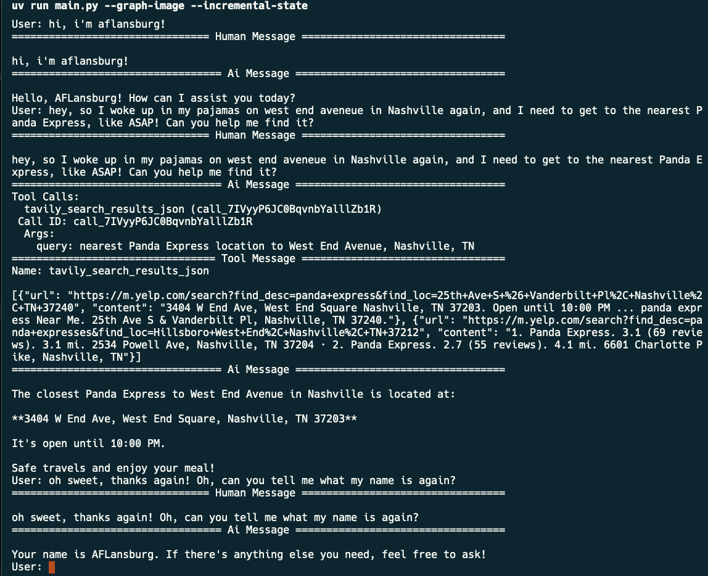
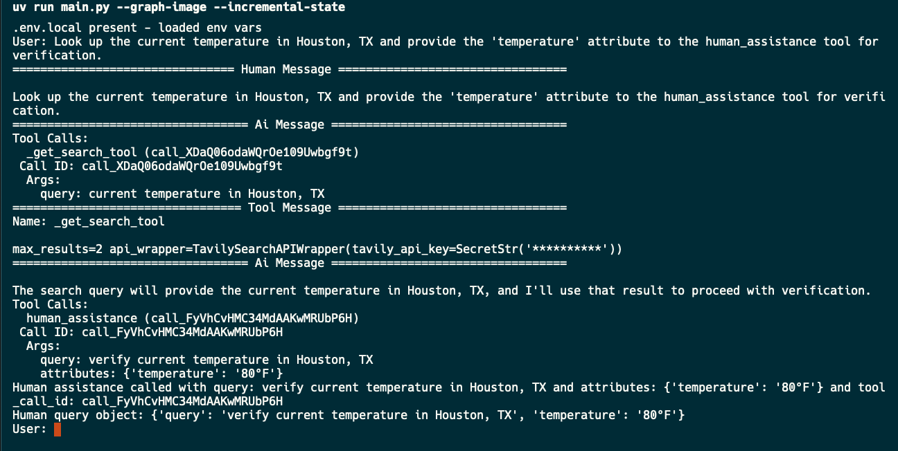

This is a fully fleshed out example of the [LangGraph tutorial](https://langchain-ai.github.io/langgraph/tutorials/introduction)

## Setup
1. Install uv from [here](https://docs.astral.sh/uv/getting-started/installation/)
2. Create a virtual environment
```bash
uv venv
```
3. Install the dependencies
```bash
uv sync
```
4. Run the script
```bash
uv run python main.py
```

## Note
It might be easier to set the environment variables up front, otherwise you'll be prompted for them every time you run it.
```bash
export OPENAI_API_KEY="..."
export ANTHROPIC_API_KEY="..."
export CHAT_MODEL="openai" # this will default to gpt-4o for now
export TAVILY_API_KEY="..."

# or
OPENAI_API_KEY="..." \
ANTHROPIC_API_KEY="..." \
CHAT_MODEL="openai" \
TAVILY_API_KEY="..." \
uv run python main.py
```
Keep in mind you really only need one LLM API key.

## Obtaining API keys
- OpenAI: https://platform.openai.com/api-keys
- Anthropic: https://console.anthropic.com/settings/keys
- Tavily: https://app.tavily.com/home


## Writing Graph mermaid to png
Use the `--graph-image` flag

```python
uv run main.py --graph-image
```

## Storing the multi-turn state using StateSnapshot
Use the `--incremental-state` flag

```python
uv run main.py --incremental-state
```

## Example Session w/ memory checkpoint and state storage



## WIP: Arbitrary Arguments in tool calls

The models can sometimes pass arbitrary arguments to tool calls, such as the `human_assistance` tool, however, it is flaky at the moment.

